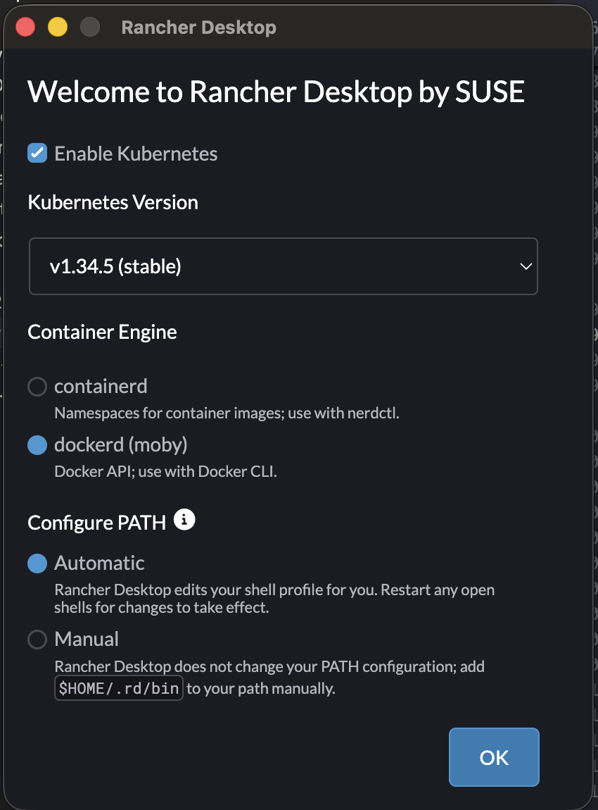
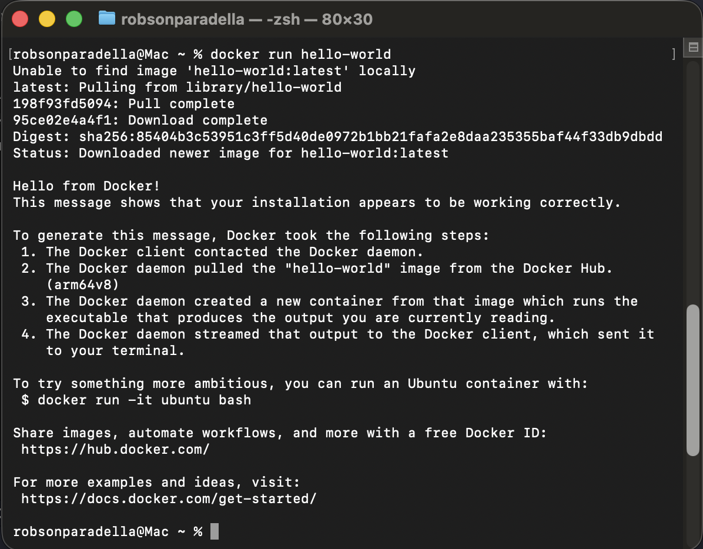
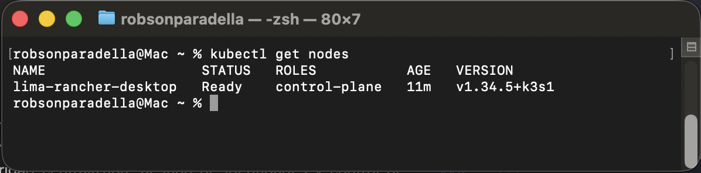
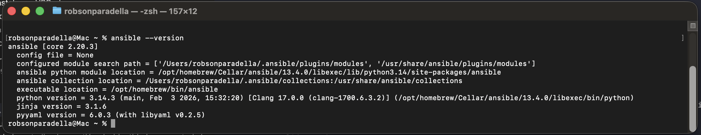

# 🛠️ Manual de Preparación de Entorno: Equipo de Infraestructura

Bienvenido al curso de **Keycloak: Seguridad Centralizada y Gestión de Identidades**. Este documento detalla los pasos para preparar tu máquina local. Durante el curso desplegaremos Keycloak en Docker y posteriormente en un clúster Kubernetes On-Premise (RKE2 / Rancher) provisionado con Ansible.

Es **obligatorio** completar y validar estas instalaciones antes de la primera sesión.

## 💻 1. Requisitos de Hardware y Sistema Operativo

* **CPU/RAM:** Mínimo 4 vCPUs y 16 GB de RAM.
* **Almacenamiento:** 100 GB de espacio libre.
* **Sistema Operativo:** * Linux Ubuntu 22.04 (Recomendado).
  * Windows 10/11: Es obligatorio tener instalado y configurado **WSL2** con la distribución Ubuntu 22.04.
  * macOS: Versiones recientes (Silicon/Intel).

---

## 📦 2. Herramientas Base y Editor

### 2.1. Git y utilidades básicas
Asegúrate de tener instaladas las herramientas de red y control de versiones:

**Linux / WSL2:**
```bash
sudo apt update
sudo apt install -y git curl wget unzip zip nano software-properties-common
```
macOS (usando Homebrew):
```
brew install git curl wget unzip zip
```
### 2.2. Visual Studio Code
Será nuestro editor principal para los manifiestos YAML y playbooks de Ansible.

Descarga e instala desde: code.visualstudio.com

Extensiones obligatorias a instalar:
- YAML (de Red Hat)
- Ansible (de Red Hat)
- Docker (de Microsoft)
- Kubernetes (de Microsoft)


## 🐳 3. Motor de Contenedores (Docker)
Necesitamos Docker para la primera fase del curso y para construir nuestras imágenes estandarizadas.
Para Linux (Ubuntu nativo):
Instala Docker Engine oficial:
```bash
curl -fsSL [https://get.docker.com](https://get.docker.com) -o get-docker.sh
sudo sh get-docker.sh
sudo usermod -aG docker $USER
# Cierra sesión y vuelve a entrar para aplicar el grupo
```
Para Windows (WSL2):
Importante Windows: Asegúrate de habilitar la integración con WSL2 en los ajustes de Docker Desktop (Settings -> Resources -> WSL Integration).


Para macOS:
Instala Docker Desktop (o Rancher Desktop, ver sección 4).
Descarga: docker.com/products/docker-desktop


## ☸️ 4. Kubernetes On-Premise (RKE2 / Rancher) y Kubectl
En el curso no usaremos soluciones K8s Cloud (EKS/AKS), simularemos un entorno On-Premise usando la distribución de Rancher: RKE2.

### 4.1. Instalación de kubectl 
El cliente de línea de comandos para hablar con el clúster.

Linux / WSL2:
```bash
curl -LO "[https://dl.k8s.io/release/$(curl](https://dl.k8s.io/release/$(curl) -L -s [https://dl.k8s.io/release/stable.txt)/bin/linux/amd64/kubectl](https://dl.k8s.io/release/stable.txt)/bin/linux/amd64/kubectl)"
sudo install -o root -g root -m 0755 kubectl /usr/local/bin/kubectl
```
macOS:
```bash
brew install kubectl
```
### 4.2. Instalación del Clúster K8s Local (RKE2)
Dado que RKE2 requiere systemd y un kernel Linux, el proceso varía según tu sistema:

Opción A: Linux Ubuntu 22.04 (Nativo o Máquina Virtual)
Instalaremos el servidor RKE2 directamente:
```bash
curl -sfL [https://get.rke2.io](https://get.rke2.io) | sudo sh -
sudo systemctl enable rke2-server.service
sudo systemctl start rke2-server.service

# Configurar el kubeconfig para tu usuario local
mkdir -p ~/.kube
sudo cp /etc/rancher/rke2/rke2.yaml ~/.kube/config
sudo chown $USER:$USER ~/.kube/config
export PATH=$PATH:/var/lib/rancher/rke2/bin
```
Opción B: macOS y Windows (La alternativa oficial: Rancher Desktop)
Dado que RKE2 nativo no corre en Mac/Windows, usaremos Rancher Desktop, que levanta una VM con K3s/RKE de forma transparente.

Descarga: rancherdesktop.io

En la instalación, selecciona la versión de Kubernetes más reciente (LTS) y como Container Engine selecciona dockerd (Moby) para tener compatibilidad con nuestros comandos de Docker.


## ⚙️ 5. Automatización: Ansible CLI
Usaremos Ansible para provisionar configuraciones y simular despliegues en infraestructura como código.

Linux / WSL2:
```bash
sudo apt update
sudo apt install -y software-properties-common
sudo add-apt-repository --yes --update ppa:ansible/ansible
sudo apt install -y ansible
```
macOS:
```bash
brew install ansible
```
## ✅ 6. Test de Validación Final
Abre una nueva terminal y ejecuta los siguientes comandos. Si todos devuelven un resultado exitoso sin errores, ¡tu máquina está lista para el curso!
```bash
# 1. Validar Docker
docker run hello-world
```

```bash
# 2. Validar Kubernetes
kubectl get nodes
```

```bash
# 3. Validar Ansible
ansible --version
```


## 📹 7. Comunicaciones (Zoom)

Como en todos los perfiles del curso, las sesiones requieren el cliente de escritorio de **Zoom** instalado y actualizado.

* **Vital para las prácticas:** Se recomienda el uso de **dos pantallas** (una para ver la pantalla del instructor y otra para tu propia consola de administración y navegador).
* Asegúrate de tener cámara, micrófono y altavoces probados antes de iniciar la primera sesión.