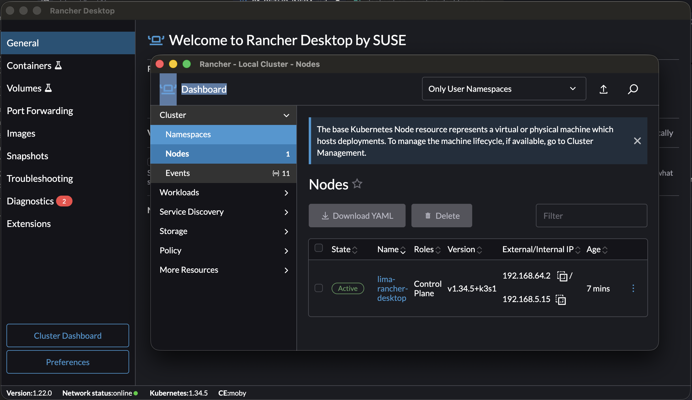
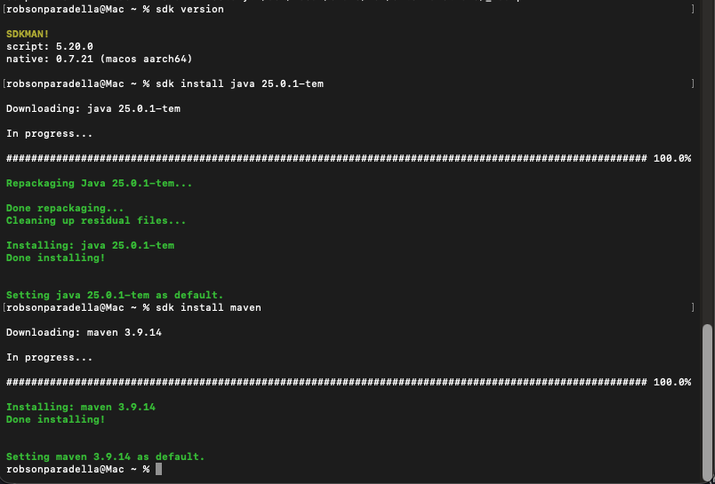
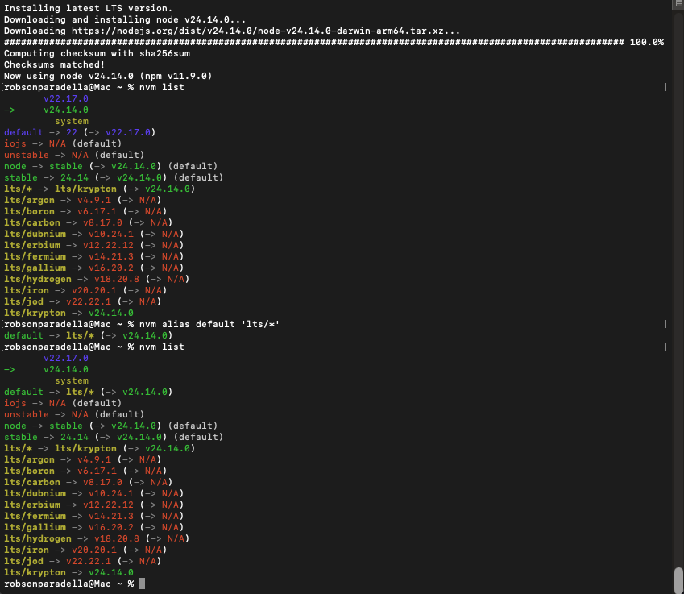
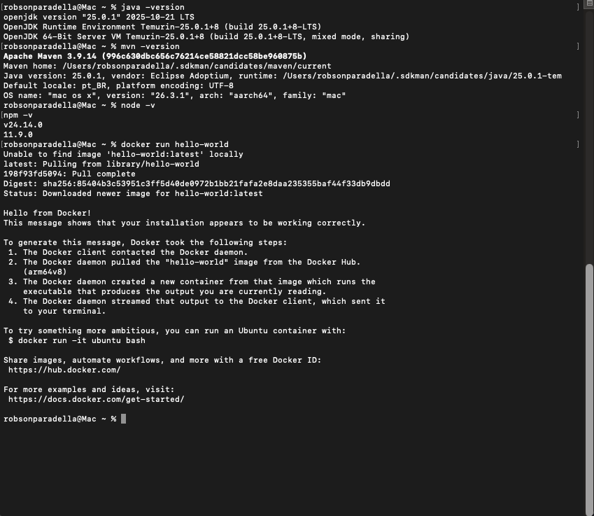

# 💻 Manual de Preparación de Entorno: Equipo de Desarrollo

Bienvenido al curso de **Keycloak: Seguridad Centralizada y Gestión de Identidades**. Este documento detalla los pasos para preparar tu máquina local como Desarrollador (Frontend y Backend). Durante el curso integraremos aplicaciones React y APIs en Java (Quarkus) con Keycloak.

Es **obligatorio** completar y validar estas instalaciones antes de la primera sesión para asegurar el correcto seguimiento de las prácticas.

## 🖥️ 1. Requisitos de Hardware y Sistema Operativo

* **CPU/RAM:** Mínimo 4 vCPUs y 16 GB de RAM.
* **Almacenamiento:** 100 GB de espacio libre.
* **Sistema Operativo:**
  * Linux Ubuntu 22.04.
  * Windows 10/11: Obligatorio tener configurado **WSL2** (Ubuntu).
  * macOS: Soportado nativamente (Intel o Apple Silicon).

---

## 🛠️ 2. Herramientas Base y Editor

### 2.1. Git
Sistema de control de versiones para descargar los repositorios de las prácticas.

**Linux / WSL2:**
```bash
sudo apt update
sudo apt install -y git curl wget unzip zip
```
macOS:
```
brew install git curl wget unzip
```
### 2.2. Visual Studio Code
Será nuestro editor principal tanto para React como para el ecosistema Java.

Descarga e instala desde: code.visualstudio.com

Extensiones obligatorias a instalar:

- Extension Pack for Java (de Microsoft)
- Quarkus (de Red Hat)
- ESLint y Prettier - Code formatter (para React/JS)
- Thunder Client, Rest Client o Postman (para probar APIs REST)



## ☕ 3. Entorno Backend: Java y Quarkus
El curso exige el uso de versiones LTS (Long Term Support). Recomendamos encarecidamente usar SDKMAN! para gestionar las versiones de Java, ya que funciona perfectamente en Linux, WSL2 y macOS.

### 3.1. Instalar SDKMAN!
SDKMAN! es el gestor estándar para instalar múltiples versiones de Java. Requiere `zip` y `unzip` para funcionar correctamente.

Abre tu terminal y ejecuta paso a paso:

```bash
# 1. Asegurar que las dependencias de compresión están instaladas
# 2. Descargar e instalar SDKMAN (sin la opción silenciosa para ver posibles errores)
curl "[https://get.sdkman.io](https://get.sdkman.io)" | bash

# 3. Inicializar SDKMAN en la sesión actual
source "$HOME/.sdkman/bin/sdkman-init.sh"
```

### 3.2. Instalar Java JDK (LTS) y Maven
Usaremos la versión 21 o 25 LTS de Java.
```
# Para instalar la LTS más extendida (Java 21)
sdk install java 21.0.2-tem

# O para instalar la nueva LTS (Java 25)
sdk install java 25.0.1-tem

# Instalar Maven (Gestor de dependencias)
sdk install maven
```


## ⚛️ 4. Entorno Frontend: Node.js y React

Para la parte de Frontend y la creación de temas personalizados (Keycloakify), necesitamos **Node LTS**. Usaremos **NVM (Node Version Manager)** para garantizar la versión correcta en todos los sistemas y evitar problemas de permisos globales.

### 4.1. Instalar NVM: Gestionar las versiones de Node
Ejecuta en tu terminal (Linux/WSL2/macOS):
```bash
curl -o- [https://raw.githubusercontent.com/nvm-sh/nvm/v0.39.7/install.sh](https://raw.githubusercontent.com/nvm-sh/nvm/v0.39.7/install.sh) | bash
# Cierra y vuelve a abrir tu terminal, o recarga el perfil:
source ~/.bashrc # o source ~/.zshrc en macOS
```
### 4.2. Instalar Node.js (LTS Activa - v24)
Ejecutaremos el comando para instalar la versión LTS (Long Term Support) actual:
```
nvm install --lts
nvm use --lts
nvm alias default 'lts/*'
```


## 🐳 5. Motor de Contenedores (Docker)
Aunque el despliegue principal de K8s lo hará el equipo de Infraestructura, como desarrollador necesitarás Docker  para arrancar rápidamente contenedores locales de Keycloak y bases de datos durante tus pruebas de código.

Para Linux (Ubuntu nativo):
```
curl -fsSL [https://get.docker.com](https://get.docker.com) -o get-docker.sh
sudo sh get-docker.sh
sudo usermod -aG docker $USER
# Cierra sesión y vuelve a entrar
```
Para Windows (WSL2) y macOS:
Instala Docker Desktop.

Descarga: docker.com/products/docker-desktop

Importante Windows: Habilita la integración con WSL2 en "Settings -> Resources -> WSL Integration".
## ✅ 6. Test de Validación Final
Abre una nueva terminal y ejecuta los siguientes comandos. Si todos devuelven un resultado exitoso sin errores (mostrando las versiones correctas), ¡tu máquina está lista para el curso!
```
# 1. Validar Java LTS (Debe mostrar 17.x o 21.x)
java -version

# 2. Validar Maven
mvn -version

# 3. Validar Node LTS (Debe mostrar 18.x, 20.x o 22.x)
node -v
npm -v

# 4. Validar Docker
docker run hello-world
```

